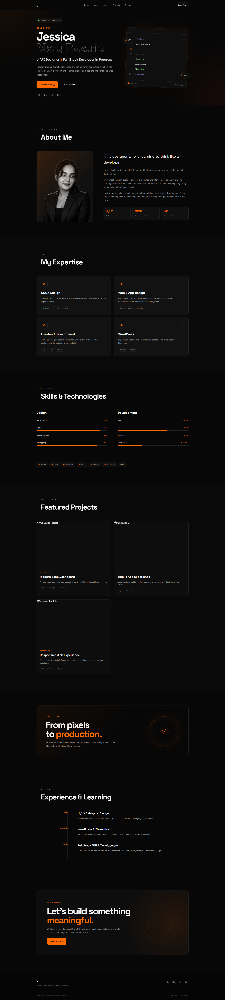

# Jessica Mary Rozario — Portfolio



## 🌐 Live Portfolio

[View Live Portfolio](https://jessicarozario22.github.io/Jessica-Mary-Rozario/)

## 📖 About the Project

This is my personal portfolio website, created to showcase my work, skills, experience, and learning journey across **UI/UX design, graphic design, frontend development, WordPress, and Full Stack MERN development**.

The portfolio follows a dark, modern, developer-inspired visual direction with orange accents. It is built around the idea of **Design × Code** — connecting thoughtful user experience with functional web development.

## ✨ Portfolio Highlights

* Modern dark-themed portfolio interface
* Responsive navigation and layout
* Hero section with personal introduction
* About Me section
* Expertise / services section
* Skills & Technologies section
* Featured Projects section
* Design × Code section
* Experience & Learning timeline
* Contact / CTA section
* Social profile links

## 🎨 Areas of Expertise

### UI/UX Design

Creating clean, intuitive, and user-focused interfaces for websites, apps, and digital products.

**Focus:** Wireframing · Prototyping · UI Design

### Web & App Design

Designing modern digital experiences with strong visual hierarchy, responsive layouts, and scalable design systems.

**Focus:** Web UI · App UI · Dashboard

### Frontend Development

Turning interface designs into responsive websites while continuously developing frontend skills.

**Technologies:** HTML · CSS · JavaScript

### WordPress

Experience creating and customizing websites using WordPress and Elementor.

## 🛠️ Skills & Technologies

### Design

* UI/UX Design
* Figma
* Graphic Design
* Prototyping

### Development

* HTML5
* CSS3
* JavaScript
* React
* Node.js
* MERN Stack — currently in progress
* WordPress
* Elementor

## 💼 Featured Projects

### 1. Modern SaaS Dashboard

A modern dashboard interface focused on clarity, usability, and scalable components.

**Tools:** Figma · UI Design · Dashboard

### 2. Mobile App Experience

A user-centered mobile interface designed around simple navigation and clear actions.

**Tools:** Figma · UX · Mobile UI

### 3. Responsive Web Experience

A responsive website built from a custom interface design using modern frontend techniques.

**Technologies:** HTML · CSS · JavaScript

## 🔗 Social & Professional Links

* [LinkedIn](https://www.linkedin.com/in/jessica-mary-rozario/)
* [Behance](https://www.behance.net/jessicarozario1)
* [Dribbble](https://dribbble.com/Rozario018)
* [GitHub](https://github.com/jessicarozario22)
* [Portfolio](https://jessicarozario22.github.io/Jessica-Mary-Rozario/)

## 💻 Technologies Used

* HTML5
* CSS3
* JavaScript
* Google Fonts — Inter & Space Grotesk
* Font Awesome

## 📂 Project Structure

```text
Jessica-Mary-Rozario/
├── Images/
├── styles/
│   └── style.css
├── index.html
├── script.js
├── Jessica-Mary-Rozario-UI-UX-Designer-Developer-09-03-2026_12_03_PM.png
└── README.md
```

## 🚀 How to Run Locally

1. Clone the repository:

```bash
git clone https://github.com/jessicarozario22/Jessica-Mary-Rozario.git
```

2. Open the project folder:

```bash
cd Jessica-Mary-Rozario
```

3. Open `index.html` in your browser.

No package installation or build tool is required for the current frontend version.

## 🎯 Design Direction

The visual identity of this portfolio is based on a **dark developer-inspired aesthetic** with orange accents and subtle glow effects.

The design communicates three main ideas:

> **Design thinking.**
> **Development learning.**
> **Building toward production.**

The portfolio intentionally positions me as a **UI/UX Designer growing into Full Stack Development**, rather than presenting development skills as already mastered.

## 📈 Current Learning Journey

I am currently expanding my development skills through **JavaScript and Full Stack MERN development**, with the goal of understanding the complete journey from design to a functional digital product.

My long-term direction is to bridge the gap between **design and code** — combining user-centered design with practical development skills.

## 👩‍💻 About Me

**Jessica Mary Rozario** is a UI/UX and graphic designer with a growing passion for web development. With a foundation in visual design, user experience, and interface design, she is currently learning Full Stack MERN development to better understand how digital products are designed, built, and brought to life.

## 📌 Project Status

**Status:** Active / Continuously Improving

This portfolio will evolve as I gain more development experience and add new projects, case studies, and technical skills.

---

### Built with ❤️ by Jessica Mary Rozario

**UI/UX Designer | Aspiring Full-Stack Developer**
